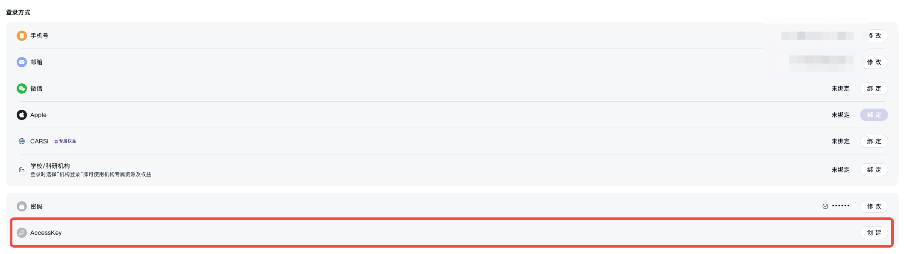

# Bohrium Skill Hub

Bohrium 平台 AI 技能集合，为 [OpenClaw](https://github.com/openclaw) 和 [Claude Code](https://claude.com/claude-code) 提供结构化的 SKILL.md 文件。每个 skill 描述一个独立能力（API 调用、Agent 工作流等），供 AI 编码助手在对话中按需加载。

[English](README_EN.md)

---

## 认证配置

所有 API Skills 需要 Bohrium AccessKey 作为鉴权凭证。

### 获取 AccessKey

1. 注册 [Bohrium](https://www.bohrium.com/)（机构用户请联系深势科技商务 bd@dp.tech 开通机构账号）
2. 登录后进入 [用户设置 → 账号页面](https://www.bohrium.com/settings/account)，复制 AccessKey



### 配置方式

根据运行环境选择其一：

**环境变量**（Claude Code / 通用）：

```bash
export BOHR_ACCESS_KEY="your_access_key_here"
```

**OpenClaw 配置文件** `~/.openclaw/openclaw.json`：

```json
{
  "skills": {
    "<skill-name>": {
      "enabled": true,
      "apiKey": "YOUR_BOHR_ACCESS_KEY",
      "env": {
        "BOHR_ACCESS_KEY": "YOUR_BOHR_ACCESS_KEY"
      }
    }
  }
}
```

---

## Claude Code 插件安装

本仓库同时是一个 Claude Code plugin marketplace：

```
/plugin marketplace add dptech-corp/bohrium-skills
/plugin install bohrium-skills@bohrium
```

装完会得到 14 个 Bohrium skill（英文版）。

---

## Skill 列表

### 平台 API Skills

通过 `bohr` CLI 或 `open.bohrium.com` HTTP API 操作 Bohrium 平台资源。

| Skill | 说明 |
|-------|------|
| [bohrium-job](zh/bohrium-job/SKILL.md) | 计算任务管理 — 提交、查询、终止、删除任务 |
| [bohrium-node](zh/bohrium-node/SKILL.md) | 开发节点管理 — 创建、启停、删除容器/虚拟机 |
| [bohrium-dataset](zh/bohrium-dataset/SKILL.md) | 数据集管理 — 创建、上传、下载、版本控制 |
| [bohrium-image](zh/bohrium-image/SKILL.md) | 容器镜像管理 — 查询、拉取、创建、删除镜像 |
| [bohrium-project](zh/bohrium-project/SKILL.md) | 项目管理 — 创建项目、管理成员、设置额度 |
| [bohrium-knowledge-base](zh/bohrium-knowledge-base/SKILL.md) | 知识库管理 — 文献管理、标签、笔记、召回搜索 |
| [bohrium-paper-search](zh/bohrium-paper-search/SKILL.md) | 论文与专利搜索 — RAG 引擎关键词+语义检索 |
| [bohrium-pdf-parser](zh/bohrium-pdf-parser/SKILL.md) | PDF 解析 — 提取文本、表格、图表、公式 |
| [bohrium-scholar-search](zh/bohrium-scholar-search/SKILL.md) | 学者搜索与画像 — 按姓名/机构检索，查看发文/引用/h-index/研究方向 |
| [bohrium-wiki](zh/bohrium-wiki/SKILL.md) | 科学百科 — 按层级浏览科学词条 |
| [bohrium-web-search](zh/bohrium-web-search/SKILL.md) | 网页搜索 — 代理 searchapi.io 做开放互联网检索 |
| [bohrium-sandbox](zh/bohrium-sandbox/SKILL.md) | 云沙箱 — 按需创建临时云 VM，运行 shell/Python |
| [bohrium-lkm](zh/bohrium-lkm/SKILL.md) | 大知识模型 — 知识节点检索、推理链检索、论文知识图谱、追溯 claim 依据、批量节点水合 |
| [bohrium-mentor](zh/bohrium-mentor/SKILL.md) | AI 科学小导师 — 基于深度推理的科学问答，自动检索文献并结构化作答 |

---

## 计费说明

以下 Skill 按调用扣账户余额，可在 [科研资产](https://www.bohrium.com/assets) 查看余额与账单：

| Skill | 类型 | 价格 |
|-------|------|------|
| bohrium-paper-search | 论文搜索（keyword） | type 0 = 0.4 元/次；type 1 = 0.8 元/次 |
| bohrium-paper-search | 专利搜索（patent） | type 0 = 0.1 元/次；type 1 = 0.6 元/次；type 2 = 1 元/次 |
| bohrium-pdf-parser | PDF 解析 | 0.05 元/页（触发解析时扣，查询结果免费） |

---

## 目录结构

```
bohrium-skill-hub/
├── zh/                          # 中文版
│   ├── bohrium-job/SKILL.md
│   ├── bohrium-node/SKILL.md
│   └── ...
├── en/                          # English version
│   ├── bohrium-job/SKILL.md
│   └── ...
├── docs/images/                 # 文档图片
├── README.md                    # 中文说明（本文件）
└── README_EN.md                 # English README
```

## SKILL.md 格式规范

每个 SKILL.md 至少包含：

```yaml
---
name: skill-name
description: "一行描述。Use when: ... NOT for: ..."
---
```

- **Frontmatter** — `name` + `description`（含使用场景和排除场景）；可选添加 `version`、`metadata.openclaw.primaryEnv`
- **正文** — 功能说明、API 端点、参数表、返回字段、代码示例、错误处理
- **代码示例** — 使用 Python `requests` 风格，优先通过 `os.environ.get("BOHR_ACCESS_KEY")` 读取密钥，不硬编码

---

## License

MIT
