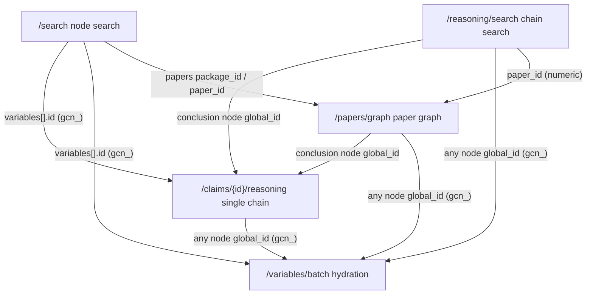

# SKILL: Bohrium LKM (Large Knowledge Model)

## Overview

LKM (Large Knowledge Model) v1 endpoints on `open.bohrium.com` let you search and trace knowledge extracted from scientific literature: search claim/question/abstract knowledge hits, retrieve reasoning chains, view a paper-level knowledge graph, trace the reasoning behind a single claim, and batch-hydrate node details by ID.

**Core capabilities:**

| Endpoint | Function |
|----------|----------|
| `POST /v1/lkm/search` | Public search: recall claim / question / abstract hits; claim scopes may also target conclusion / premise roles |
| `POST /v1/lkm/reasoning/search` | Reasoning chain search: recall whole chains by argument similarity |
| `POST /v1/lkm/papers/graph` | Paper-level knowledge graph: full graph extracted from a paper |
| `GET /v1/lkm/claims/{id}/reasoning` | Single-claim reasoning chain: why a claim holds |
| `POST /v1/lkm/variables/batch` | Batch hydration: fetch node details by an ID list |
| `POST /v1/lkm/feedback` | Submit feedback: report a bug / feature request / question about LKM content or service |

**Choosing an entry point:**

- Find claims/questions/abstracts by keyword/semantics → `/search`
- Find whole reasoning chains whose research/experimental process is similar (not just a single matching claim) → `/reasoning/search`
- Open one paper and view its full structured graph → `/papers/graph`
- Have a claim ID, want its reasoning chain → `/claims/{id}/reasoning`
- Have a set of node IDs, want to hydrate details → `/variables/batch`
- Want to report a bug / feature request / question about a node, paper, or the service → `/feedback`

**Don't use for:**

- General paper keyword search → `bohrium-paper-search`
- Knowledge base file management → `bohrium-knowledge-base`
- Single PDF parsing → `bohrium-pdf-parser`

**No CLI support** — HTTP API only.

## How the endpoints connect

The 5 retrieval endpoints fall into two groups:

- **Natural-language search entry points** (only need `query`, no ID up front): `/search`, `/reasoning/search`
- **Identifier/ID-based lookups** (need a paper identifier or node ID first): `/papers/graph` (paper `package_id`/`paper_id`/`doi`/`title`), `/claims/{id}/reasoning` (claim `gcn_` ID), `/variables/batch` (node `gcn_` ID)

(`/feedback` is a standalone write endpoint, not part of the retrieval data flow below — see section 6.)

> `/papers/graph` can be a standalone starting point if you already have a DOI or title; otherwise its `package_id`/`paper_id` typically comes from paper metadata returned by `/search` or `/reasoning/search`.

A search entry point's output (node IDs, paper IDs) is exactly the downstream input. `/search` defaults to paper aggregation: each main `variables[]` row is the representative hit for roughly one paper, and same-paper hits are folded into `related`. Abstract hits are paper-level background context; do not treat them as claims or reasoning roots.



**ID flow:**

| Upstream output | ID type | Usable downstream |
|------|------|------|
| `search` `variables[].id`; graph node `global_id` | global node ID `gcn_...` | `variables/batch` (any node); `claims/{id}/reasoning` (only `has_reasoning=true` conclusions) |
| `papers`/`paper` metadata; `reasoning_chains[].paper_id` | paper ID (`paper:<number>` or plain numeric) | `papers/graph` (`package_id`/`paper_id`); `reasoning/search` `filters.paper_ids` (plain numeric, no `paper:` prefix) |

**Pitfall:** do not pass a graph local node ID (e.g. `paper:...::conclusion_3`) as a global `gcn_` ID or paper ID downstream — `claims/{id}/reasoning` returns `290004`, and `variables/batch` puts it in `not_found`.

> `/feedback` optionally reuses an upstream global node ID (`gcn_id`) or paper metadata ID (`paper_metadata_id`) to pin the feedback target; the two are mutually exclusive.

## Auth configuration

The code reads the access key from the `BOHR_ACCESS_KEY` environment variable. Provide it in one of two ways depending on the runtime:

**Option A: set the environment variable directly** (when not running under OpenClaw)

```bash
export BOHR_ACCESS_KEY=<YOUR_BOHR_ACCESS_KEY>
```

**Option B: inject via OpenClaw** (when running inside OpenClaw)

Configure `~/.openclaw/openclaw.json`; OpenClaw injects `env.BOHR_ACCESS_KEY` into the runtime environment automatically:

```json
"bohrium-lkm": {
  "enabled": true,
  "apiKey": "YOUR_BOHR_ACCESS_KEY",
  "env": {
    "BOHR_ACCESS_KEY": "YOUR_BOHR_ACCESS_KEY"
  }
}
```

## Common template

```python
import os, requests

AK = os.environ["BOHR_ACCESS_KEY"]
BASE = "https://open.bohrium.com/openapi/v1/lkm"
H = {"Authorization": f"Bearer {AK}", "Content-Type": "application/json"}

def lkm_data(r):
    """Unwrap an LKM response: return data when code == 0, else raise with code/message."""
    body = r.json()
    if body.get("code") != 0:
        raise RuntimeError(f"LKM error {body.get('code')}: {body.get('message')}")
    return body["data"]
```

The examples below call `lkm_data(r)` so the documented `code` contract is always enforced.

**Business status:** HTTP usually returns 200; success is determined by `code` in the response body, where `code == 0` means success. See the error-code table at the end.

---

## 1. Public search — `POST /search`

Recall claim / question / abstract hits in LKM via natural language. By default, the server aggregates by paper and returns one representative main hit per paper, with additional same-paper hits in `related`. It returns hits and paper metadata, not full reasoning chains.

```python
r = requests.post(f"{BASE}/search", headers=H, json={
    "query": "The 2017 chemistry curriculum standard increases emphasis on real‑world problem situations and contexts (explicitly including industrial production, environmental issues, and socio‑technical “hot topics”).",
    "keywords": ["real-world contexts", "industrial production", "inquiry learning"],
    "retrieval_mode": "hybrid",
    "sort_by": "comprehensive",  # optional; default comprehensive; or relevance/recent/journal
    "scopes": ["claim", "question", "abstract", "conclusion", "premise"],
    # "filters": {
    #     "paper_ids": ["811977903947382784"],  # plain numeric IDs, no paper: prefix
    #     "dois": ["10.1038/s41586-021-03381-x"],
    #     "title": "perovskite stability",      # fuzzy title filter
    #     "publication_date_start": "2020-01-01",
    #     "publication_date_end": "2026-12-31",
    #     "limit_publication_date": True,        # default true; false also recalls undated papers
    # },
    "reasoning_only": False,
    "offset": 0,
    "limit": 20
})
data = lkm_data(r)
for v in data["variables"]:
    print(v["id"], v["type"], v.get("role"), v["has_reasoning"], (v.get("content") or "")[:80])
# data["related"]: other relevant same-paper hits folded under the representative hit
# data["papers"]: authoritative paper metadata referenced by hits (key like paper:<id>)
# data["has_more"]: whether more pages exist
```

**Parameters:**

| Field | Type | Required | Description |
|-------|------|----------|-------------|
| `query` | string | yes | Natural language query, ≤200 chars recommended |
| `keywords` | string[] | no | Up to 10, ≤100 chars each; put terms/materials/methods/abbreviations, not full sentences |
| `retrieval_mode` | string | no | `hybrid`(default, semantic+lexical) / `semantic`(vector only, faster) / `lexical`(keyword only) |
| `sort_by` | string | no | Sort strategy, default `comprehensive` when omitted: `relevance`(pure relevance, most on-target top hit) / `recent`(prefers newer once relevance bar is met) / `journal`(prefers high-quality journals once relevance bar is met) / `comprehensive`(relevance+recency+quality+diversity combined) |
| `scopes` | string[] | no | Restrict hit scope: node types `claim` / `question` / `abstract`, or claim roles `conclusion` / `premise`; omit = no restriction |
| `filters.visibility` | string | no | Content visibility, usually `public` |
| `filters.role` | string | no | Restrict claim role: `conclusion`/`premise`/`highlight` |
| `filters.paper_ids` | string[] | no | Restrict recall to papers, plain numeric IDs, **no `paper:` prefix**, up to 50 |
| `filters.dois` | string[] | no | Restrict recall to papers by DOI, up to 50; can be combined with `paper_ids` |
| `filters.title` | string | no | Fuzzy paper-title filter. When combined with `paper_ids` / `dois`, all dimensions are intersected (AND). Title filtering returns only the most relevant few papers by default and is not exhaustive. |
| `filters.publication_date_start` / `filters.publication_date_end` | string | no | Publication-date bounds in `YYYY-MM-DD`; either side may be omitted |
| `filters.limit_publication_date` | bool | no | Default `true`: apply the given date range; if both bounds are omitted, fall back to approximately the last 20 years. Set `false` to remove publication-date filtering entirely and recall undated papers. |
| `reasoning_only` | bool | no | `true` returns only conclusion claims backed by a reasoning chain (legacy alias `evidence_only`) |
| `include_paper_enrich` | bool | no | `true` returns richer paper metadata (larger response; use only when needed) |
| `offset` | int | no | Page start, max 10000 |
| `limit` | int | no | Page size, default 20, max 100 |

**Key response fields:**

| Field | Description |
|-------|-------------|
| `data.variables[]` | Main result list after aggregation; each row is the representative hit for roughly one paper. `id` is the hit object ID. |
| `data.variables[].type` | `claim`, `question`, or `abstract` |
| `data.variables[].role` | Claim role: `conclusion` / `premise`, etc. |
| `data.variables[].score` / `rerank_score` | Retrieval rank score — **not credibility/evidence strength**, do not show as confidence |
| `data.variables[].has_reasoning` | Whether the claim has a traceable reasoning chain (prefer `true` when showing reasoning) |
| `data.variables[].provenance.source_packages` | Source paper package IDs |
| `data.related` | Other relevant same-paper snippets folded under the main hit. This is same-paper context, not cross-paper recommendation and not the complete paper graph. |
| `data.papers` | Authoritative paper metadata map, key like `paper:<id>`; use this for paper cards, DOI, journal, impact factor, etc. |
| `data.has_more` | Whether more pages exist (next page: same body, `offset += page count`) |

**Constraints and policy:**

- `paper_ids`, `dois`, and `title` are intersected (AND). If any dimension resolves to no papers, the whole result is empty.
- `abstract` hits are paper-level context for judging relevance or RAG background. Do **not** use them as claims and do not request reasoning chains from them.
- When `reasoning_only=true`, `scopes` must be omitted or `["claim"]` / `["conclusion"]`, and `filters.role` must be omitted or `conclusion`; conflicts return `290002`.

> **Sorting note:** the recency/quality boosts in `recent`/`journal`/`comprehensive` are all relevance-gated, so they never pull in irrelevant content; existing callers that omit `sort_by` automatically get the better `comprehensive` default ordering.

---

## 2. Reasoning chain search — `POST /reasoning/search`

Recall whole reasoning chains — the research process a paper used to reach a conclusion (theoretical derivation, numerical computation, experimental procedure) — ranked by how similar that process is to your query, not by single-node text match. New callers should always pass `format: "graph"`.

```python
r = requests.post(f"{BASE}/reasoning/search", headers=H, json={
    "query": "infer phase stability from XRD evidence",
    "keywords": ["powder XRD", "Rietveld refinement", "phase transition"],
    "retrieval_mode": "hybrid",
    "sort_by": "comprehensive",  # optional; default comprehensive; or relevance/recent/journal
    "format": "graph",
    # "filters": {
    #     "paper_ids": ["811977903947382784"],
    #     "dois": ["10.1038/s41586-021-03381-x"],
    #     "title": "phase stability",
    #     "publication_date_start": "2020-01-01",
    #     "limit_publication_date": True,
    # },
    "offset": 0,
    "limit": 20
})
data = lkm_data(r)
for c in data["reasoning_chains"]:
    print(c["chain_id"], c["paper_id"], c["score"])
    print("  nodes:", len(c["graph"]["nodes"]), "edges:", len(c["graph"]["edges"]))
# data["total"]: total hits not truncated by limit
```

**Parameters:**

| Field | Type | Required | Description |
|-------|------|----------|-------------|
| `query` | string | yes | Describe the reasoning process you want, ≤200 chars recommended |
| `keywords` | string[] | no | Up to 10; put method/material/condition/metric/abbreviation names |
| `retrieval_mode` | string | no | `hybrid`(default) / `semantic` / `lexical` |
| `sort_by` | string | no | Sort strategy, same values/semantics as `/search` (`relevance`/`recent`/`journal`/`comprehensive`), default `comprehensive` when omitted |
| `filters.paper_ids` / `filters.dois` | string[] | no | Restrict recall to papers, same semantics as `/search`: plain numeric IDs (no `paper:` prefix) / DOIs, ≤50 each, can be combined |
| `filters.title` | string | no | Fuzzy paper-title filter; intersects (AND) with `paper_ids` and `dois` |
| `filters.publication_date_start` / `filters.publication_date_end` | string | no | Publication-date bounds in `YYYY-MM-DD`; either side may be omitted |
| `filters.limit_publication_date` | bool | no | Default `true`; if both bounds are omitted, fall back to approximately the last 20 years. `false` removes publication-date filtering and can recall undated papers. |
| `format` | string | no | Recommended `graph`, returns `graph.nodes`/`graph.edges`; omit returns legacy structure |
| `offset` | int | no | Page start, max 10000 |
| `limit` | int | no | Page size, default 20, max 100 |

**Key response fields (`format: "graph"`):**

| Field | Description |
|-------|-------------|
| `data.reasoning_chains[].chain_id` | Reasoning chain ID |
| `data.reasoning_chains[].paper_id` | Source paper ID (plain numeric) |
| `data.reasoning_chains[].score` | Retrieval rank score — **do not show as confidence** |
| `data.reasoning_chains[].graph` | Chain graph (`nodes` / `edges`, see graph section) |
| `data.reasoning_chains[].paper` | Source paper metadata |
| `data.reasoning_chains[].addressed_problems` / `open_questions` | Problems addressed / open questions |
| `data.total` | Total hits; pagination: more pages if `offset + page count < total` |

`paper_ids`, `dois`, and `title` filters are intersected (AND), as in `/search`; an empty match in any dimension yields an empty result set.

---

## 3. Paper-level knowledge graph — `POST /papers/graph`

Given a paper, return the full graph LKM extracted from it (conclusions, reasoning steps, highlights, weak points, subproblems and relation edges). The main entry point for paper-level graphs.

```python
r = requests.post(f"{BASE}/papers/graph", headers=H, json={
    "package_id": "paper:1020661015349559308"   # one of four identifiers, see below
})
data = lkm_data(r)
for p in data["papers"]:
    print(p["paper"]["en_title"])
    print("  nodes:", len(p["graph"]["nodes"]), "edges:", len(p["graph"]["edges"]))
    print("  addressed_problems:", len(p["addressed_problems"]))
```

**Parameters (at least one of the four identifiers; not all empty):**

| Field | Type | Description |
|-------|------|-------------|
| `package_id` | string | LKM package ID, like `paper:<number>`; **highest priority** |
| `paper_id` | string | LKM paper ID, plain numeric, e.g. `812481689673531392` |
| `doi` | string | Paper DOI, e.g. `10.1038/s41586-021-03381-x` |
| `title` | string | Title or title keywords; may return multiple candidates |
| `title_resolve.limit` | int | When using `title`, cap candidates; default 5, max 20 |

> Priority: `package_id > paper_id > doi > title`. `package_id`/`paper_id` are LKM-internal IDs (not DOI/PMID), usually obtained from paper metadata returned by other LKM endpoints.

**Key response fields:**

| Field | Description |
|-------|-------------|
| `data.papers[].paper` | Paper metadata (`package_id`, title, authors, DOI, journal, etc.) |
| `data.papers[].graph` | Paper-level knowledge graph (`nodes` / `edges`, see graph section) |
| `data.papers[].addressed_problems` | Core problems the paper addresses |
| `data.papers[].open_questions` | Open questions / future work |

> Non-title paths usually return 1 paper; title path may return multiple candidates (each may carry `title_match_type`, e.g. `exact`/`keyword`). `include`/`hydrate_factor_refs` are legacy compatibility fields; the new default graph response does not need them.

---

## 4. Single-claim reasoning chain — `GET /claims/{id}/reasoning`

Given a global claim ID (`gcn_...`), return the reasoning steps and premises that support it. New callers should always pass `format=graph`.

```python
claim_id = "gcn_73e13bb548f847bd"
r = requests.get(f"{BASE}/claims/{claim_id}/reasoning", headers=H,
                 params={"format": "graph", "max_chains": 10, "sort_by": "comprehensive"})
data = lkm_data(r)
print(data["claim"]["id"], "total_chains:", data["total_chains"])
for c in data["reasoning_chains"]:
    print("  paper:", c["paper"]["en_title"])
    print("  nodes:", len(c["graph"]["nodes"]), "edges:", len(c["graph"]["edges"]))
```

**Parameters:**

| Field | In | Required | Description |
|-------|----|----------|-------------|
| `id` | path | yes | Global claim ID, like `gcn_...` (do NOT pass graph local node IDs like `paper:...::conclusion_3`) |
| `max_chains` | query | no | Max chains, default 10, max 100 |
| `sort_by` | query | no | `comprehensive`(default, by informativeness) / `recent`(newest first) |
| `format` | query | no | Recommended `graph`; omit or non-graph returns legacy `factors` structure |

**Key response fields (`format=graph`):**

| Field | Description |
|-------|-------------|
| `data.claim` | The queried claim itself (`id`/`type`/`content_hash`) |
| `data.reasoning_chains[].graph` | Chain graph (`nodes` / `edges`, see graph section) |
| `data.reasoning_chains[].paper` | Source paper metadata for the chain |
| `data.reasoning_chains[].addressed_problems` / `open_questions` | Problem background / open questions |
| `data.total_chains` | Total number of available chains |

> Prefer calling only on claims with `role = conclusion` and `has_reasoning = true`. Calling on premise / weak point / no-reasoning claims may return `290008`; wrong ID type often returns `290004`.

---

## 5. Batch hydration — `POST /variables/batch`

Fetch node details by ID list. Get IDs from a search endpoint first, then hydrate here. **This is not a search endpoint.**

```python
r = requests.post(f"{BASE}/variables/batch", headers=H, json={
    "ids": ["gcn_654cd35dcb814a0c", "gcn_9523aa7f1fd04d8a"]
})
data = lkm_data(r)
for v in data["variables"]:
    print(v["id"], v["type"], (v.get("content") or "")[:80])
print("not_found:", data["not_found"])
# data["papers"]: paper metadata organized by package_id
```

**Parameters:**

| Field | Type | Required | Description |
|-------|------|----------|-------------|
| `ids` | string[] | yes | Global node IDs (`gcn_...`), 1–100, **no empty strings**; duplicates are deduped |

**Key response fields:**

| Field | Description |
|-------|-------------|
| `data.variables[]` | Matched nodes (`id`/`type`/`title`/`content`/`representative_lcn`/`local_members`/`provenance`) |
| `data.variables[].metadata` / `parameters` | **Parse defensively**: may be empty string, JSON string, or array string |
| `data.not_found` | IDs not matched (graph local IDs / paper IDs / package IDs land here) |
| `data.papers` | Paper metadata organized by `package_id` |

> Clean the list first: drop empty strings/null, dedupe, batch ≤100. Partial misses do not fail the request (still `code = 0`).

---

## 6. Submit feedback — `POST /feedback`

Submit usage feedback about the LKM service / data. Optionally link it to a GCN node or a paper metadata record to pin the exact target. **This is a write endpoint; it returns no knowledge content.**

```python
r = requests.post(f"{BASE}/feedback", headers=H, json={
    "type": "bug",          # required: bug / feature / question, case-insensitive
    "content": "Reasoning-chain results are missing premise nodes; likely a data gap",  # required, non-empty after trim
    "gcn_id": "gcn_0002bee76d0c4255"  # optional; link a GCN node. Mutually exclusive with paper_metadata_id
    # or link a paper instead: drop gcn_id and pass "paper_metadata_id": "867766664756724177"
})
fb = lkm_data(r)
print("feedback id:", fb["id"])
```

**Parameters (Body):**

| Field | Type | Required | Description |
|-------|------|----------|-------------|
| `type` | string | yes | Feedback type: `bug` / `feature` / `question`, case-insensitive |
| `content` | string | yes | Feedback body, non-empty after trim |
| `gcn_id` | string | no | Linked GCN node ID (from `/search`, graph, etc.), e.g. `gcn_0002bee76d0c4255`; mutually exclusive with `paper_metadata_id` |
| `paper_metadata_id` | string | no | Linked paper metadata ID, e.g. `867766664756724177`; mutually exclusive with `gcn_id` |

**Key response fields:**

| Field | Description |
|-------|-------------|
| `data.id` | Primary key ID of the newly created feedback record |

> `gcn_id` and `paper_metadata_id` may both be empty (no specific target), but **cannot both be non-empty** — passing both is rejected to avoid ambiguity.

---

## Shared graph notes (endpoints 2 / 3 / 4)

`graph` consists of `nodes` and `edges`, ready for frontend graph rendering.

**Node `kind`:**

| kind | Meaning |
|------|---------|
| `conclusion` | Conclusion node (in endpoint 4, usually the passed claim) |
| `reasoning_steps` | Reasoning steps supporting a conclusion, usually with a `steps[]` array |
| `highlight` | Positive highlight / key evidence / supporting observation |
| `weak_point` | Weakness / limitation / risk / premise to treat cautiously |
| `subproblem` | Subproblem or research motivation driving the conclusion |

**Edge `type`:**

| type | Meaning |
|------|---------|
| `concludes` | reasoning_steps points to conclusion |
| `highlight_of` | highlight points to the reasoning_steps it supports (positive) |
| `weakpoint_of` | weak_point points to the reasoning_steps it weakens (limitation/risk) |
| `subproblem_of` | subproblem points to the conclusion it drives |
| `previous_conclusion_of` | Contextual/precedence relation between a prior conclusion and the current one |

**Notes:**

- `highlight_of` and `weakpoint_of` are opposites — positive vs. limitation/risk; do not treat every edge as "support".
- Do not treat `highlight` as the final conclusion, `weak_point` as positive evidence, or `subproblem` as supporting evidence.
- Edge `p1`/`p2` are model/graph internal parameters — **do not show as user-facing confidence**.
- `reasoning_steps.steps` is best shown as node detail, not expanded into multiple main-graph nodes by default.

---

## Worked example: verify and trace a scientific conclusion

> Idea: use `/search` (`reasoning_only=true`) to find a conclusion backed by a reasoning chain, then use `/claims/{id}/reasoning` to see why it holds.

```python
# 1) Search: only conclusion claims backed by a reasoning chain
res = lkm_data(requests.post(f"{BASE}/search", headers=H, json={
    "query": "perovskite thermal stability at 85 C",
    "keywords": ["FAPbI3", "thermal stability"],
    "retrieval_mode": "hybrid",
    "reasoning_only": True,
    "scopes": ["conclusion"],
    "limit": 10,
}))

# 2) Pick the first traceable conclusion
claim = next((v for v in res["variables"] if v.get("has_reasoning")), None)
if not claim:
    print("No conclusion with a traceable reasoning chain")
else:
    print("Conclusion:", (claim.get("content") or "")[:120])
    # 3) Trace: fetch the reasoning chain for this claim
    chains = lkm_data(requests.get(f"{BASE}/claims/{claim['id']}/reasoning",
                                   headers=H, params={"format": "graph"}))
    for c in chains["reasoning_chains"]:
        print("Source paper:", c["paper"]["en_title"])
        for n in c["graph"]["nodes"]:
            print(f"  [{n['kind']}] {(n.get('title') or n['content'])[:80]}")
```

---

## curl examples

Auth and `code` handling are identical across endpoints. One POST and one GET shown below; other endpoints differ only in path and body (bodies are in each section above).

```bash
AK="$BOHR_ACCESS_KEY"
BASE="https://open.bohrium.com/openapi/v1/lkm"

# POST example (other POST endpoints work the same: just change path and body)
curl -s -X POST "$BASE/search" \
  -H "Authorization: Bearer $AK" -H "Content-Type: application/json" \
  -d '{"query":"perovskite thermal stability","retrieval_mode":"hybrid","scopes":["abstract","conclusion"],"filters":{"title":"perovskite","publication_date_start":"2020-01-01"},"limit":20}' | jq .

# GET example (single-claim reasoning chain)
curl -s -X GET "$BASE/claims/gcn_73e13bb548f847bd/reasoning?format=graph&max_chains=10" \
  -H "Authorization: Bearer $AK" | jq .
```

---

## Error codes

| code | Meaning | Fix |
|------|---------|-----|
| `2000` | Unauthorized | Check `BOHR_ACCESS_KEY` validity and that the request carries `Authorization: Bearer` |
| `290002` | Invalid params | Check `retrieval_mode`/`scopes` values, `keywords` over limit, pagination bounds, `reasoning_only` vs scopes/role conflict, title/date filter format, empty/over-100 `ids`, `package_id` format |
| `290001` | Search/query failed | Retry once; if still failing, shorten query or lower limit |
| `290004` | Claim not found | Ensure you pass a global `gcn_...`, not a graph local node ID |
| `290008` | Claim has no reasoning chain | Only call reasoning on conclusions with `has_reasoning=true` |
| `290009` | Query timeout | Retry later, or use a more precise `paper_id`/`package_id` |
| `290011` | Paper not found | Check `paper_id`/`package_id`/`doi`/`title` |
| `290013` | Paper exists but no graph extracted | Show paper metadata and note no structured graph yet |

---

## Pairs well with

> For chaining between LKM endpoints, see "How the endpoints connect" and the "Worked example" above. This section lists cross-skill pairings only.

- **lkm** after verifying/tracing a conclusion → **bohrium-paper-search** for the original full text
- **lkm** after locating a specific paper → **bohrium-pdf-parser** to parse a single PDF
- **lkm** batch-hydration / graph results → **bohrium-knowledge-base** to archive
