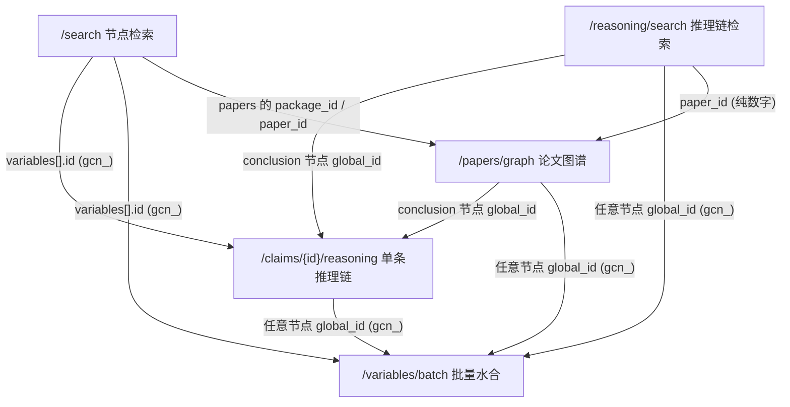

# SKILL: Bohrium LKM (大知识模型)

## 概述

通过 `open.bohrium.com` 的 LKM (Large Knowledge Model) v1 端点，对科研文献中抽取出的知识进行检索与追溯：搜索命题/研究问题节点、检索推理链、查看论文级知识图谱、追溯单条命题的支撑推理、按 ID 批量水合节点详情。

**核心能力：**

| 端点 | 功能 |
|------|------|
| `POST /v1/lkm/search` | 知识节点检索：召回相关的 claim / question 节点 |
| `POST /v1/lkm/reasoning/search` | 推理链检索：按论证过程相似性召回整条推理链 |
| `POST /v1/lkm/papers/graph` | 论文级知识图谱：返回某篇论文抽取出的完整 graph |
| `GET /v1/lkm/claims/{id}/reasoning` | 单条命题推理链：查某条 claim 为什么成立 |
| `POST /v1/lkm/variables/batch` | 批量水合：按节点 ID 列表批量取详情 |

**怎么选入口：**

- 按关键词/语义找命题或问题 → `/search`
- 想找"论证/实验过程"相似的整条推理链（而非单个命题）→ `/reasoning/search`
- 打开一篇论文看完整结构化图谱 → `/papers/graph`
- 已有 claim ID，想看推理链 → `/claims/{id}/reasoning`
- 已有一组节点 ID，想批量补全详情 → `/variables/batch`

**不适用：**

- 通用论文关键词搜索 → `bohrium-paper-search`
- 知识库文件管理 → `bohrium-knowledge-base`
- PDF 单篇解析 → `bohrium-pdf-parser`

**无 CLI 支持** — 通过 HTTP API 操作。

## 接口调用关系

把 5 个接口分成两类：

- **自然语言检索入口**（只需 `query`，无需预先知道任何 ID）：`/search`、`/reasoning/search`
- **基于标识/ID 的查询**（需先有论文标识或节点 ID）：`/papers/graph`（论文 `package_id`/`paper_id`/`doi`/`title`）、`/claims/{id}/reasoning`（claim `gcn_` ID）、`/variables/batch`（节点 `gcn_` ID）

> `/papers/graph` 若已知 DOI 或标题，也可不依赖其它接口、直接作为起点；否则其 `package_id`/`paper_id` 通常来自 `/search`、`/reasoning/search` 返回的论文元数据。

检索入口的输出（节点 ID、论文 ID）正是下游接口的输入，数据流如下：



**ID 流转：**

| 上游输出 | ID 类型 | 下游可用接口 |
|------|------|------|
| `search` 的 `variables[].id`；graph 节点的 `global_id` | 全局节点 ID `gcn_...` | `variables/batch`（任意节点）；`claims/{id}/reasoning`（仅 `has_reasoning=true` 的 conclusion） |
| 各接口 `papers`/`paper` 元数据；`reasoning_chains[].paper_id` | 论文 ID（`paper:<数字>` 或纯数字串） | `papers/graph`（`package_id`/`paper_id`）；`reasoning/search` 的 `filters.paper_ids`（纯数字、无 `paper:` 前缀） |

**陷阱：** 不要把 graph 本地节点 ID（如 `paper:...::conclusion_3`）当成全局 `gcn_` ID 或论文 ID 往下游传——`claims/{id}/reasoning` 会返回 `290004`，`variables/batch` 会把它放进 `not_found`。

## 认证配置

代码统一从环境变量 `BOHR_ACCESS_KEY` 读取 access key。根据运行环境，二选一方式提供该变量：

**方式 A：直接使用环境变量**（不依赖 OpenClaw 的场景）

```bash
export BOHR_ACCESS_KEY=<YOUR_BOHR_ACCESS_KEY>
```

**方式 B：通过 OpenClaw 注入**（在 OpenClaw 中运行时）

在 `~/.openclaw/openclaw.json` 配置，OpenClaw 会自动将 `env.BOHR_ACCESS_KEY` 注入到运行环境：

```json
"bohrium-lkm": {
  "enabled": true,
  "apiKey": "YOUR_BOHR_ACCESS_KEY",
  "env": {
    "BOHR_ACCESS_KEY": "YOUR_BOHR_ACCESS_KEY"
  }
}
```

## 通用代码模板

```python
import os, requests

AK = os.environ["BOHR_ACCESS_KEY"]
BASE = "https://open.bohrium.com/openapi/v1/lkm"
H = {"Authorization": f"Bearer {AK}", "Content-Type": "application/json"}
```

**业务状态判定：** HTTP 通常返回 200，是否成功看响应体里的 `code`，`code == 0` 才算成功。常见错误码见末尾错误码表。

---

## 1. 知识节点检索 — `POST /search`

用自然语言召回 LKM 中的 claim / question 节点。返回的是一个个节点，不是完整推理链。

```python
r = requests.post(f"{BASE}/search", headers=H, json={
    "query": "perovskite thermal stability",
    "keywords": ["FAPbI3", "Cs doping"],
    "retrieval_mode": "hybrid",
    "scopes": ["claim", "question"],
    "reasoning_only": False,
    "offset": 0,
    "limit": 20
})
data = r.json()["data"]
for v in data["variables"]:
    print(v["id"], v["type"], v.get("role"), v["has_reasoning"], v["content"][:80])
# data["papers"]: 命中节点引用到的论文元数据（key 形如 paper:<id>）
# data["has_more"]: 是否还有下一页
```

**参数：**

| 字段 | 类型 | 必填 | 说明 |
|------|------|------|------|
| `query` | string | 是 | 自然语言检索语句，建议 ≤200 字 |
| `keywords` | string[] | 否 | 关键词，最多 10 个、每个 ≤100 字；放术语/材料名/方法名/缩写，不要塞整句 |
| `retrieval_mode` | string | 否 | `hybrid`(默认,语义+关键词) / `semantic`(仅语义,更快) / `lexical`(仅关键词) |
| `sort_by` | string | 否 | 排序策略，不传默认 `comprehensive`：`relevance`(纯相关性,首位最准) / `recent`(相关达标前提下偏新) / `journal`(相关达标前提下偏高质量期刊) / `comprehensive`(相关+时效+质量+多样性综合) |
| `scopes` | string[] | 否 | 限定节点类型：`claim`、`question`；省略=不限定 |
| `filters.visibility` | string | 否 | 内容可见性，通常 `public` |
| `filters.role` | string | 否 | 限定 claim 角色：`conclusion`/`premise`/`highlight` |
| `filters.paper_ids` | string[] | 否 | 按论文维度限定召回范围，纯数字论文 ID，**不带 `paper:` 前缀**，最多 50 个 |
| `filters.dois` | string[] | 否 | 按论文维度限定召回范围，论文 DOI，最多 50 个；服务端先换成 paper_id 再与 `paper_ids` 合并过滤；可与 `paper_ids` 同时使用，省略=不限定论文范围 |
| `reasoning_only` | bool | 否 | `true` 只返回有推理链支撑的 conclusion claim（旧名 `evidence_only`） |
| `include_paper_enrich` | bool | 否 | `true` 返回更丰富的论文元数据（响应变大，按需开） |
| `offset` | int | 否 | 分页起点，最大 10000 |
| `limit` | int | 否 | 每页条数，默认 20，最大 100 |

**关键返回字段：**

| 字段 | 说明 |
|------|------|
| `data.variables[].id` | 全局节点 ID（`gcn_...`），可用于后续 reasoning / batch 查询 |
| `data.variables[].type` | `claim` 或 `question` |
| `data.variables[].role` | claim 角色：`conclusion`/`premise` 等 |
| `data.variables[].score` | 检索排序分数，**不等于可信度/证据强度**，不要当置信度展示 |
| `data.variables[].has_reasoning` | 该 claim 是否有推理链可追溯（展示推理时优先选 `true`） |
| `data.variables[].provenance.source_packages` | 来源论文包 ID 列表 |
| `data.papers` | 论文元数据 map，key 形如 `paper:<id>` |
| `data.has_more` | 是否还有下一页（下一页用相同请求体，`offset += 本页条数`） |

**约束：** `reasoning_only=true` 时，`scopes` 必须省略或 `["claim"]`，`filters.role` 必须省略或 `conclusion`；冲突会返回 `290002`。

> **排序说明：** `recent`/`journal`/`comprehensive` 的时效、质量加成都有相关性门控，不会塞进不相关内容；老调用方不传 `sort_by` 即自动享受更优的 `comprehensive` 默认排序。

---

## 2. 推理链检索 — `POST /reasoning/search`

召回整条推理链——即论文"得出某个结论的研究过程"（理论推导、数值计算、实验流程等），按该过程与 query 的相似度排序，而不是按单个节点的文本相似度。新调用方统一传 `format: "graph"`。

```python
r = requests.post(f"{BASE}/reasoning/search", headers=H, json={
    "query": "infer phase stability from XRD evidence",
    "keywords": ["powder XRD", "Rietveld refinement", "phase transition"],
    "retrieval_mode": "hybrid",
    "sort_by": "comprehensive",  # 可选，默认 comprehensive；可选 relevance/recent/journal
    "format": "graph",
    "filters": {                 # 可选，按论文维度限定召回范围
        "paper_ids": ["811977903947382784"],  # 纯数字串，无 paper: 前缀，≤50 个
        "dois": ["10.1038/s41586-021-03381-x"]  # ≤50 个，可与 paper_ids 同时用
    },
    "offset": 0,
    "limit": 20
})
data = r.json()["data"]
for c in data["reasoning_chains"]:
    print(c["chain_id"], c["paper_id"], c["score"])
    print("  nodes:", len(c["graph"]["nodes"]), "edges:", len(c["graph"]["edges"]))
# data["total"]: 未受 limit 截断的命中总数
```

**参数：**

| 字段 | 类型 | 必填 | 说明 |
|------|------|------|------|
| `query` | string | 是 | 描述想找的推理过程，建议 ≤200 字 |
| `keywords` | string[] | 否 | 最多 10 个，放方法名/材料名/实验条件/指标/缩写 |
| `retrieval_mode` | string | 否 | `hybrid`(默认) / `semantic` / `lexical` |
| `sort_by` | string | 否 | 排序策略，不传默认 `comprehensive`：`relevance`(纯相关性,首位最准) / `recent`(相关达标前提下偏新) / `journal`(相关达标前提下偏高质量期刊) / `comprehensive`(相关+时效+质量+多样性综合) |
| `filters.paper_ids` | string[] | 否 | 按论文维度限定召回范围，纯数字串，**不带 `paper:` 前缀**，最多 50 个 |
| `filters.dois` | string[] | 否 | 按论文维度限定召回范围，论文 DOI，最多 50 个；服务端先换成 paper_id 再与 `paper_ids` 合并过滤；可与 `paper_ids` 同时使用，省略=不限定论文范围 |
| `format` | string | 否 | 推荐 `graph`，返回 `graph.nodes`/`graph.edges`；省略返回旧结构 |
| `offset` | int | 否 | 分页起点，最大 10000 |
| `limit` | int | 否 | 每页条数，默认 20，最大 100 |

**关键返回字段（`format: "graph"`）：**

| 字段 | 说明 |
|------|------|
| `data.reasoning_chains[].chain_id` | 推理链 ID |
| `data.reasoning_chains[].paper_id` | 来源论文 ID（纯数字串） |
| `data.reasoning_chains[].score` | 检索排序分数，**不要当可信度展示** |
| `data.reasoning_chains[].graph` | 推理链图谱（`nodes` / `edges`，见下方 graph 说明） |
| `data.reasoning_chains[].paper` | 来源论文元数据 |
| `data.reasoning_chains[].addressed_problems` / `open_questions` | 该链处理的问题 / 留下的开放问题 |
| `data.total` | 命中总数；分页：`offset + 本页条数 < total` 即有下一页 |

> **排序说明：** 与 `/search` 语义一致——`recent`/`journal`/`comprehensive` 的时效、质量加成均有相关性门控，不会引入不相关内容；不传 `sort_by` 即默认 `comprehensive`。

---

## 3. 论文级知识图谱 — `POST /papers/graph`

给定一篇论文，返回 LKM 从中抽取出的完整 graph（结论、推理步骤、亮点、弱点、子问题及关系边）。paper-level graph 主入口。

```python
r = requests.post(f"{BASE}/papers/graph", headers=H, json={
    "package_id": "paper:1020661015349559308"   # 四选一，见下表
})
data = r.json()["data"]
for p in data["papers"]:
    print(p["paper"]["en_title"])
    print("  nodes:", len(p["graph"]["nodes"]), "edges:", len(p["graph"]["edges"]))
    print("  addressed_problems:", len(p["addressed_problems"]))
```

**参数（4 个标识至少传 1 个，不能都空）：**

| 字段 | 类型 | 说明 |
|------|------|------|
| `package_id` | string | LKM 论文包 ID，形如 `paper:<数字>`；**优先级最高** |
| `paper_id` | string | LKM 论文 ID，纯数字串，如 `812481689673531392` |
| `doi` | string | 论文 DOI，如 `10.1038/s41586-021-03381-x` |
| `title` | string | 标题或标题关键词，可能返回多篇候选 |
| `title_resolve.limit` | int | 用 `title` 时限制候选数，默认 5，最大 20 |

> 优先级：`package_id > paper_id > doi > title`。`package_id`/`paper_id` 是 LKM 内部 ID（非 DOI/PMID），通常从其它 LKM 接口返回的 paper 元数据获取。

**关键返回字段：**

| 字段 | 说明 |
|------|------|
| `data.papers[].paper` | 论文元数据（含 `package_id`、标题、作者、DOI、期刊等） |
| `data.papers[].graph` | 论文级知识图谱（`nodes` / `edges`，见下方 graph 说明） |
| `data.papers[].addressed_problems` | 论文试图解决的核心问题 |
| `data.papers[].open_questions` | 论文留下的开放问题 / 未来工作 |

> 非 title 路径通常返回 1 篇；title 路径可能返回多篇候选（每篇可能带 `title_match_type`，如 `exact`/`keyword`）。`include`/`hydrate_factor_refs` 为历史兼容字段，新版默认 graph 响应无需使用。

---

## 4. 单条命题推理链 — `GET /claims/{id}/reasoning`

给定一个全局 claim ID（`gcn_...`），返回这条 claim 由哪些推理步骤和前提支撑。新调用方统一传 `format=graph`。

```python
claim_id = "gcn_73e13bb548f847bd"
r = requests.get(f"{BASE}/claims/{claim_id}/reasoning", headers=H,
                 params={"format": "graph", "max_chains": 10, "sort_by": "comprehensive"})
data = r.json()["data"]
print(data["claim"]["id"], "total_chains:", data["total_chains"])
for c in data["reasoning_chains"]:
    print("  paper:", c["paper"]["en_title"])
    print("  nodes:", len(c["graph"]["nodes"]), "edges:", len(c["graph"]["edges"]))
```

**参数：**

| 字段 | 位置 | 必填 | 说明 |
|------|------|------|------|
| `id` | path | 是 | 全局 claim ID，形如 `gcn_...`（不要传 graph 本地节点 ID，如 `paper:...::conclusion_3`） |
| `max_chains` | query | 否 | 推理链数量上限，默认 10，最大 100 |
| `sort_by` | query | 否 | `comprehensive`(默认,按信息量) / `recent`(按时间倒序) |
| `format` | query | 否 | 推荐 `graph`；省略或非 graph 返回旧 `factors` 结构 |

**关键返回字段（`format=graph`）：**

| 字段 | 说明 |
|------|------|
| `data.claim` | 被查询的 claim 本身（`id`/`type`/`content_hash`） |
| `data.reasoning_chains[].graph` | 推理链图谱（`nodes` / `edges`，见下方 graph 说明） |
| `data.reasoning_chains[].paper` | 该链所属论文元数据 |
| `data.reasoning_chains[].addressed_problems` / `open_questions` | 问题背景 / 开放问题 |
| `data.total_chains` | 可返回的推理链总数 |

> 建议只对 `role = conclusion` 且 `has_reasoning = true` 的 claim 调用。对 premise / weak point / 无推理链的 claim 调用可能返回 `290008`；传错 ID 类型常返回 `290004`。

---

## 5. 批量水合 — `POST /variables/batch`

按节点 ID 列表批量取详情。先用检索接口拿到 ID，再用本接口补全。**这不是检索接口。**

```python
r = requests.post(f"{BASE}/variables/batch", headers=H, json={
    "ids": ["gcn_654cd35dcb814a0c", "gcn_9523aa7f1fd04d8a"]
})
data = r.json()["data"]
for v in data["variables"]:
    print(v["id"], v["type"], v["content"][:80])
print("not_found:", data["not_found"])
# data["papers"]: 按 package_id 组织的论文元数据
```

**参数：**

| 字段 | 类型 | 必填 | 说明 |
|------|------|------|------|
| `ids` | string[] | 是 | 全局节点 ID（`gcn_...`），1–100 个，**不要含空字符串**；重复会去重 |

**关键返回字段：**

| 字段 | 说明 |
|------|------|
| `data.variables[]` | 命中的节点（`id`/`type`/`title`/`content`/`representative_lcn`/`local_members`/`provenance`） |
| `data.variables[].metadata` / `parameters` | **需防御式解析**：可能是空串、JSON 字符串或数组字符串 |
| `data.not_found` | 未命中的 ID 列表（传 graph 本地 ID / paper ID / package ID 会落这里） |
| `data.papers` | 按 `package_id` 组织的论文元数据 |

> 请求前先清洗：去空串、去 null、去重、单批 ≤100。部分 ID 未命中不影响整体成功（仍 `code = 0`）。

---

## graph 公共说明（端点 2 / 3 / 4 共享）

`graph` 由 `nodes` 和 `edges` 组成，可直接用于前端图谱渲染。

**节点 `kind`：**

| kind | 含义 |
|------|------|
| `conclusion` | 结论节点（端点 4 中通常对应传入的 claim） |
| `reasoning_steps` | 支撑结论的推理步骤，通常含 `steps[]` 数组 |
| `highlight` | 正向亮点 / 关键证据 / 支持性观察 |
| `weak_point` | 弱点 / 限制 / 风险 / 需审慎看待的前提 |
| `subproblem` | 驱动该结论的子问题或研究动机 |

**边 `type`：**

| type | 含义 |
|------|------|
| `concludes` | reasoning_steps 指向 conclusion |
| `highlight_of` | highlight 指向它支持的 reasoning_steps（正向） |
| `weakpoint_of` | weak_point 指向它削弱的 reasoning_steps（限制/风险） |
| `subproblem_of` | subproblem 指向它驱动的 conclusion |
| `previous_conclusion_of` | 前序结论与当前结论/推理单元的上下文关系 |

**注意：**

- `highlight_of` 与 `weakpoint_of` 语义相反——前者正向、后者表示限制或风险；不要把所有边都当成"支持"。
- 不要把 `highlight` 当最终结论，不要把 `weak_point` 当正向证据，不要把 `subproblem` 当支撑证据。
- 边上的 `p1`/`p2` 是模型/图谱内部参数，**不要直接当作用户侧可信度展示**。
- `reasoning_steps.steps` 建议作为节点详情展开，不必默认拆成多个主图节点。

---

## 典型工作流：验证并追溯一个科学结论

> 思路：先用 `/search`（`reasoning_only=true`）找到"有推理链支撑的结论"，再用 `/claims/{id}/reasoning` 看它为什么成立。

```python
# 1) 检索：只要有推理链支撑的 conclusion claim
res = requests.post(f"{BASE}/search", headers=H, json={
    "query": "perovskite thermal stability at 85 C",
    "keywords": ["FAPbI3", "thermal stability"],
    "retrieval_mode": "hybrid",
    "reasoning_only": True,
    "limit": 10,
}).json()["data"]

# 2) 取第一个可追溯的结论
claim = next((v for v in res["variables"] if v.get("has_reasoning")), None)
if not claim:
    print("未找到可追溯推理链的结论")
else:
    print("结论:", claim["content"][:120])
    # 3) 追溯：查这条 claim 的推理链
    chains = requests.get(f"{BASE}/claims/{claim['id']}/reasoning",
                          headers=H, params={"format": "graph"}).json()["data"]
    for c in chains["reasoning_chains"]:
        print("来源论文:", c["paper"]["en_title"])
        for n in c["graph"]["nodes"]:
            print(f"  [{n['kind']}] {(n.get('title') or n['content'])[:80]}")
```

---

## curl 示例

```bash
AK="$BOHR_ACCESS_KEY"
BASE="https://open.bohrium.com/openapi/v1/lkm"

# 1. 知识节点检索（sort_by 可选，默认 comprehensive；filters.paper_ids/dois 可选限定论文范围）
curl -s -X POST "$BASE/search" \
  -H "Authorization: Bearer $AK" -H "Content-Type: application/json" \
  -d '{"query":"perovskite thermal stability","keywords":["FAPbI3","Cs doping"],"retrieval_mode":"hybrid","sort_by":"comprehensive","limit":20}' | jq .

# 2. 推理链检索（sort_by 可选；filters.paper_ids/dois 可选，各 ≤50）
curl -s -X POST "$BASE/reasoning/search" \
  -H "Authorization: Bearer $AK" -H "Content-Type: application/json" \
  -d '{"query":"infer phase stability from XRD","keywords":["powder XRD"],"format":"graph","sort_by":"journal","filters":{"dois":["10.1038/s41586-021-03381-x"]},"limit":20}' | jq .

# 3. 论文级知识图谱
curl -s -X POST "$BASE/papers/graph" \
  -H "Authorization: Bearer $AK" -H "Content-Type: application/json" \
  -d '{"package_id":"paper:1020661015349559308"}' | jq .

# 4. 单条命题推理链
curl -s -X GET "$BASE/claims/gcn_73e13bb548f847bd/reasoning?format=graph&max_chains=10" \
  -H "Authorization: Bearer $AK" | jq .

# 5. 批量水合
curl -s -X POST "$BASE/variables/batch" \
  -H "Authorization: Bearer $AK" -H "Content-Type: application/json" \
  -d '{"ids":["gcn_654cd35dcb814a0c","gcn_9523aa7f1fd04d8a"]}' | jq .
```

---

## 常见错误码

| code | 含义 | 处理 |
|------|------|------|
| `2000` | 未授权 | 检查 `BOHR_ACCESS_KEY` 是否有效、请求头是否带 `Authorization: Bearer` |
| `290002` | 入参错误 | 检查 `retrieval_mode`/`scopes` 取值、`keywords` 超限、分页越界、`reasoning_only` 与 scopes/role 冲突、`ids` 为空或超 100、`package_id` 格式 |
| `290001` | 检索/查询失败 | 重试一次；仍失败则缩短 query 或降低 limit |
| `290004` | claim 不存在 | 确认传的是全局 `gcn_...`，而非 graph 本地节点 ID |
| `290008` | claim 无推理链 | 仅对 `has_reasoning=true` 的 conclusion 调用 reasoning |
| `290009` | 查询超时 | 稍后重试，或改用更精确的 `paper_id`/`package_id` |
| `290011` | 论文不存在 | 检查 `paper_id`/`package_id`/`doi`/`title` |
| `290013` | 论文存在但未抽出 graph | 展示论文元数据并提示暂无结构化图谱 |

---

## 搭配使用

> LKM 各接口之间的串联见上文「接口调用关系」与「典型工作流」。这里只列跨 skill 的搭配。

- **lkm** 验证/追溯结论后 → **bohrium-paper-search** 找原始论文全文
- **lkm** 定位到具体论文后 → **bohrium-pdf-parser** 解析单篇 PDF
- **lkm** 批量水合/图谱结果 → **bohrium-knowledge-base** 归档存储
