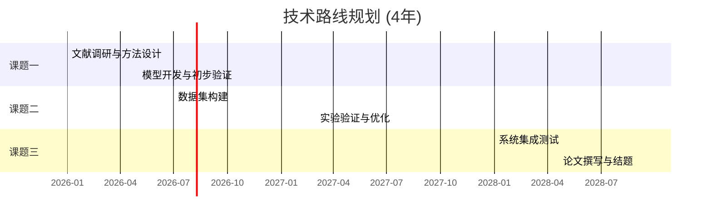

# SKILL: 基金申请辅助 (Grant Application Helper)

## 概述

编排多个 Bohrium 原子技能（`paper-search`、`scholar-search`、`lkm`、`web-search`），为用户撰写基金申请书提供一站式辅助。核心产出对标**国家自然科学基金（NSFC）**申请书中的关键章节：研究现状、研究基础、创新点、技术路线和可行性论证。

**编排的原子技能：**

| 技能 | 作用 |
|------|------|
| `paper-search` | 检索国内外文献，分析研究现状与前沿 |
| `scholar-search` | 识别领域主要学者与团队，建立学术网络地图 |
| `lkm` | 映射理论基础，发现创新切入点，验证创新论断 |
| `web-search` | 查询基金指南、政策导向、资助趋势 |

**适用场景：**

- 撰写 NSFC 面上/青年/重点项目申请书
- 准备研究现状综述段落
- 提炼和验证创新点
- 整理申请人研究基础

**不适用：**

- 通用文献综述（无基金写作需求）→ 使用 `literature-review`
- 选题探索（尚未确定方向）→ 使用 `topic-scout`
- 纯论文搜索 → 使用 `bohrium-paper-search`

**无 CLI 支持** — 通过 Python 脚本编排 HTTP API 操作。

## 认证配置

本技能复用以下原子技能的 ACCESS_KEY，在 `~/.openclaw/openclaw.json` 中确保已配置：

```json
{
  "bohrium-paper-search": {
    "enabled": true,
    "env": { "ACCESS_KEY": "YOUR_ACCESS_KEY" }
  },
  "bohrium-scholar-search": {
    "enabled": true,
    "env": { "ACCESS_KEY": "YOUR_ACCESS_KEY" }
  },
  "bohrium-lkm": {
    "enabled": true,
    "env": { "ACCESS_KEY": "YOUR_ACCESS_KEY" }
  },
  "bohrium-web-search": {
    "enabled": true,
    "env": { "ACCESS_KEY": "YOUR_ACCESS_KEY" }
  }
}
```

所有技能共享同一个 Bohrium AccessKey，只需在 Bohrium 平台（https://bohrium.dp.tech）个人设置页获取一次。

---

## 输入参数

| 参数 | 类型 | 必填 | 说明 |
|------|------|------|------|
| `research_direction` | string | 是 | 拟研究方向，如"基于图神经网络的分子性质预测" |
| `existing_achievements` | list | 是 | 申请人已有成果列表（论文/专利/项目） |
| `grant_type` | string | 否 | 基金类型，默认 `"NSFC面上项目"`；可选 `"NSFC青年项目"`、`"NSFC重点项目"` 等 |

---

## 数据质量控制（关键步骤）

API 返回的论文列表可能包含与申请人子领域不匹配的结果（关键词语义泛化导致），**必须在生成申请辅助内容前进行相关性过滤**。

### 过滤规则

```python
def filter_relevant_papers(papers, subfield_keywords, min_hits=2):
    """
    只保留标题+摘要中至少命中 min_hits 个子领域核心术语的论文。

    subfield_keywords: 申请人具体子领域的核心术语
    例如申请方向 "基于图神经网络的分子性质预测"
    subfield_keywords = ["graph neural", "molecular property", "GNN", "message passing", "prediction"]
    """
    filtered = []
    for p in papers:
        text = (p.get("enName", "") + " " + p.get("enAbstract", "")).lower()
        hits = sum(1 for k in subfield_keywords if k.lower() in text)
        if hits >= min_hits:
            filtered.append(p)
    return filtered
```

### 过滤后检查

- 如果过滤后 <5 篇：放宽 `min_hits=1` 或扩展子领域关键词
- 如果过滤后仍有大量不相关结果：在研究现状中明确说明检索范围的局限性
- **永远不要**在研究现状综述中引用明显不属于申请方向的论文

---

## 报告分析深度要求

**申请辅助内容不是 API 数据的格式化转储**。你是一个基金申请顾问，必须在输出中提供：

1. **竞争团队识别**：列出该方向的主要竞争团队（机构+PI），评估竞争格局
2. **创新性深度解读**：不能仅报告 `new_claim_likely=True/False`，必须解释为什么是新颖的、与已有工作具体差异在哪里、审稿人可能如何评价
3. **预算相关范围评估**：研究路线涉及的计算/实验资源规模，是否与申请预算匹配
4. **基于数据的立项论证**：从论文增长趋势、未解决问题频次等数据论证立项必要性
5. **竞品下一步预判**：不仅列出竞争团队"在做什么"，还要推断"他们最可能的下一步"，以便用户差异化

### 创新点措辞的严谨性（P0 级别要求）

**"空白"论断极其危险**——如果评审人恰好在做你声称"不存在"的工作，本子直接被毙。

必须遵循的规则：
- ❌ "XX 方法在 YY 领域的应用尚属空白" — 除非你确认了顶会(NeurIPS/ICML/ICLR)和预印本(arXiv)也没有
- ✅ "据本检索范围（2020-2026 年 Q1/Q2 期刊），尚未发现将 XX 系统应用于 YY 的工作" — 带限定
- ✅ "虽然 EquiformerV2 已在 OC20 上达到 SOTA (MAE ~0.02 eV)，但其在 [具体子问题] 上尚未被探索" — 承认现有 SOTA，找精确差异化

**必须对标当前 leaderboard / SOTA**：
- 如果领域有公开 leaderboard（如 OC20、QM9、CASP），预期成果指标必须参照 leaderboard 现有最好结果
- 不能设定一个低于已有 SOTA 的指标作为"预期成果"（评审人会直接看出来）
- 如果课题目标不是"超越 SOTA"而是"拓展场景"，必须明确说明这一点

### 定量 claim 必须有来源

所有数字（"降低 90%"、"MAE < 0.3 eV"）必须附来源：
- 来自文献：标注 "[Author, Journal, Year]"
- 来自 leaderboard：标注 "[来源: XX Leaderboard, 截至 YYYY-MM]"
- 自己估算：标注 "（估算依据: ...）"
- 没有来源的数字 → 不写，或标注为 "待论证"

### 计算资源估算要具体

不接受 "~50,000 CPU 核时" 这种没有拆解的数字。必须给出估算过程：
- 如："200 个催化构型 × 每构型 ~500 CPU核时（4层 slab, PBE, 500 eV cutoff）= 100,000 核时"
- 或引用类似工作的实际消耗："参考 Tran et al. (2023) 中类似规模计算的报告"

### 禁止的行为

- 仅列出 `new_claim_likely=True` 就声称"创新性强"，不给出具体理由
- 在研究现状中罗列论文而不做归纳分析
- 生成脱离申请人已有成果的可行性论证
- 基于标题猜测论文内容（如果没有摘要，不要总结该论文的核心贡献）
- 声称某方向"尚属空白"但未核实顶会/arXiv/leaderboard

### 推荐的做法

- 深度解读创新性："LKM 匹配到 3 条相关论断（最高 score=0.65），均为前提假设而非结论，表明本创新点在已有理论基础上提出了新的结论方向"
- 量化竞争格局："该方向目前 MIT Coley 组、清华 Li 组等 5 个团队活跃，年发文约 30 篇，属于中等竞争"
- 评估资源匹配度："技术路线涉及大规模分子动力学模拟，预计需要 GPU 集群 2000+ 卡时，需确认预算充足"
- 明确数据局限："以上竞争分析基于 scholar-search 返回的前 10 位学者，实际竞争团队可能更多"
- 预判竞争："Ulissi 组最可能的下一步是将 EquiformerV2 扩展到 OC22 的氧化物催化体系；本项目应避开该方向，转攻多元合金的组合筛选"

---

## 工作流程

```
输入：研究方向 + 已有成果 + 基金类型
  │
  ├─ Step 1: 领域现状分析（并行）
  │   ├─ paper-search   → 检索国内外文献，提取高被引论文和前沿趋势
  │   └─ scholar-search → 识别领域主要学者、团队和机构分布
  │
  ├─ Step 2: 理论基础与创新点挖掘
  │   ├─ lkm /search    → 映射理论基础和知识图谱
  │   └─ lkm /claims/match → 验证候选创新论断的新颖性
  │
  ├─ Step 3: 政策与资助趋势（并行）
  │   └─ web-search     → 查询 NSFC 指南、政策方向、资助动态
  │
  └─ Step 4: 综合生成
      └─ 结合用户已有成果，输出五大板块内容
```

---

## 输出内容

| 板块 | 说明 | 对应申请书章节 |
|------|------|----------------|
| 研究现状综述 | 国内外研究进展段落，含引用 | 立项依据 — 研究现状 |
| 研究基础总结 | 申请人前期工作与积累 | 研究基础与工作条件 |
| 创新点提炼 | 2-3 个经 LKM 验证的创新点 | 创新点 |
| 技术路线建议 | 分阶段技术路线图（含 Mermaid 甘特图） | 研究方案 — 技术路线 |
| 可行性论证要点 | 人员、设备、方法、前期基础 | 可行性分析 |
| 预算参考 | 各类目比例建议（按项目类型） | 经费预算 |
| 计算资源估算 | GPU/CPU 核时估算（如涉及计算类课题） | 经费预算 — 设备费 |

### 技术路线图格式

技术路线必须输出为 **Mermaid 甘特图**，便于申请人直接嵌入申请书：



### 计算资源估算规则（涉及计算类课题时必须包含）

如技术路线涉及 DFT、MD、ML 训练等计算密集型任务，**必须**给出资源估算：
- 明确说明估算依据（如"按 100 原子 slab 模型，单点计算约 200 CPU 核时"）
- 给出总计算量和对应预算（如"共需 ~50,000 GPU 卡时，按 A100 云计算定价约 XX 万元"）
- 如果预算中设备费比例偏高/偏低，主动指出并给出调整建议

---

## 完整编排脚本

以下 Python 脚本实现端到端的基金申请辅助流程。

```python
#!/usr/bin/env python3
"""
grant_helper.py — 基金申请辅助编排脚本

用法：
  export ACCESS_KEY="your_bohrium_access_key"
  python grant_helper.py

可根据实际需要修改 RESEARCH_DIRECTION、EXISTING_ACHIEVEMENTS、GRANT_TYPE。
"""

import os
import sys
import json
import requests
from concurrent.futures import ThreadPoolExecutor, as_completed

# ── 配置 ─────────────────────────────────────────────

AK = os.environ.get("ACCESS_KEY", "")
if not AK:
    print("错误：未检测到 ACCESS_KEY 环境变量。")
    print("请在 ~/.openclaw/openclaw.json 中配置 ACCESS_KEY，或执行：")
    print("  export ACCESS_KEY='your_bohrium_access_key'")
    sys.exit(1)

BASE = "https://open.bohrium.com/openapi/v1"
H_JSON = {"accessKey": AK, "Content-Type": "application/json"}
H_GET  = {"accessKey": AK}

# ── 用户输入（按需修改）──────────────────────────────

RESEARCH_DIRECTION = "基于图神经网络的分子性质预测方法研究"
EXISTING_ACHIEVEMENTS = [
    "发表 SCI 论文 15 篇，其中一区 8 篇",
    "主持国家自然科学基金青年项目 1 项（已结题）",
    "授权发明专利 3 项",
    "开发开源工具 MolGNN，GitHub star 500+",
]
GRANT_TYPE = "NSFC面上项目"

# ── 工具函数 ──────────────────────────────────────────

def safe_request(method, url, **kwargs):
    """统一请求封装，带错误处理。"""
    try:
        r = requests.request(method, url, timeout=30, **kwargs)
        r.raise_for_status()
        return r.json()
    except requests.exceptions.Timeout:
        print(f"  [超时] {url}")
        return None
    except requests.exceptions.HTTPError as e:
        print(f"  [HTTP 错误] {url}: {e}")
        if r.status_code == 401:
            print("  → ACCESS_KEY 无效，请更新后重试。")
        return None
    except Exception as e:
        print(f"  [请求异常] {url}: {e}")
        return None


# ── Step 1: 领域现状分析 ─────────────────────────────

def search_papers(direction, page_size=20):
    """检索领域相关的高质量论文。"""
    # 从研究方向中提取英文关键词（实际使用时应根据方向调整）
    keywords = direction_to_keywords(direction)
    question = direction_to_question(direction)

    data = safe_request("POST", f"{BASE}/paper/rag/pass/keyword",
        headers=H_JSON,
        json={
            "words": keywords,
            "question": question,
            "type": 5,
            "startTime": "2020-01-01",
            "endTime": "2026-12-31",
            "jcrZones": ["Q1", "Q2"],
            "pageSize": page_size,
        })

    if not data or data.get("code") != 0:
        print("  [警告] 论文搜索未返回有效结果")
        return []
    return data.get("data", [])


def search_scholars(direction, page_size=10):
    """识别领域主要学者。"""
    tags = direction_to_tags(direction)
    # 按研究方向搜索活跃学者
    data = safe_request("POST", f"{BASE}/paper-server/scholar/search",
        headers=H_JSON,
        json={
            "name": "",
            "tags": tags,
            "page": 1,
            "pageSize": page_size,
        })

    if not data or not data.get("data"):
        print("  [警告] 学者搜索未返回有效结果")
        return []
    return data["data"].get("items", [])


def direction_to_keywords(direction):
    """将中文研究方向转换为英文关键词列表。
    实际使用时可接入翻译 API 或手动指定。"""
    keyword_map = {
        "图神经网络": "graph neural network",
        "分子性质预测": "molecular property prediction",
        "分子动力学": "molecular dynamics",
        "深度学习": "deep learning",
        "机器学习势函数": "machine learning potential",
        "蛋白质结构预测": "protein structure prediction",
        "催化": "catalysis",
        "电池": "battery",
        "材料": "materials",
    }
    keywords = []
    for zh, en in keyword_map.items():
        if zh in direction:
            keywords.append(en)
    # 如果没有命中预定义关键词，使用研究方向本身
    if not keywords:
        keywords = [direction]
    return keywords


def direction_to_question(direction):
    """将中文研究方向转换为英文搜索问题。"""
    keywords = direction_to_keywords(direction)
    return " ".join(keywords) + " recent advances and methods"


def direction_to_tags(direction):
    """将研究方向转换为学者搜索标签。"""
    keywords = direction_to_keywords(direction)
    return ", ".join(keywords)


# ── Step 2: 理论基础与创新点 ─────────────────────────

def search_knowledge_graph(direction, limit=10):
    """通过 LKM 搜索理论基础。"""
    question = direction_to_question(direction)
    data = safe_request("POST", f"{BASE}/lkm/search",
        headers=H_JSON,
        json={
            "query": f"theoretical foundation of {question}",
            "limit": limit,
        })
    return data


def validate_innovation_claim(claim_text, limit=5):
    """通过 LKM claims/match 验证创新论断。

    关键指标：new_claim_likely
      - True  → 该论断在已有文献中缺乏充分支持/反驳，可能是新发现 → 适合作为创新点
      - False → 已有大量相关证据，新颖性不足 → 需重新提炼

    返回:
      dict: {
        "claim": 原始论断,
        "new_claim_likely": bool,
        "supporting_variables": list,
        "related_papers": dict,
      }
    """
    data = safe_request("POST", f"{BASE}/lkm/claims/match",
        headers=H_JSON,
        json={
            "text": claim_text,
            "limit": limit,
        })

    if not data or not data.get("data"):
        return {
            "claim": claim_text,
            "new_claim_likely": None,
            "supporting_variables": [],
            "related_papers": {},
            "error": "LKM 未返回有效结果",
        }

    result = data["data"]
    return {
        "claim": claim_text,
        "new_claim_likely": result.get("new_claim_likely", None),
        "supporting_variables": result.get("variables", []),
        "related_papers": result.get("papers", {}),
    }


# ── Step 3: 政策与资助趋势 ───────────────────────────

def search_funding_guidelines(grant_type, direction):
    """通过 web-search 查询基金指南和政策方向。"""
    queries = [
        f"{grant_type} 申请指南 {_current_year()}",
        f"国家自然科学基金 {direction} 资助",
        f"NSFC {direction_to_tags(direction)} funding guide",
    ]
    all_results = []
    for q in queries:
        data = safe_request("GET", f"{BASE}/search/web",
            headers=H_GET,
            params={"q": q, "num": 5})
        if data and data.get("organic_results"):
            all_results.extend(data["organic_results"])
    return all_results


def _current_year():
    from datetime import date
    return str(date.today().year)


# ── Step 4: 综合输出 ─────────────────────────────────

def generate_research_status(papers, scholars):
    """生成研究现状综述段落。

    写作技巧（NSFC 风格）：
    1. 按 "国际→国内" 的顺序组织
    2. 先综述宏观趋势，再聚焦具体方法
    3. 每段引用 3-5 篇代表性论文
    4. 最后指出现有研究的不足和空白
    """
    print("\n" + "=" * 60)
    print("一、研究现状（国内外研究进展）")
    print("=" * 60)

    if papers:
        # 按被引次数排序，提取高被引论文
        sorted_papers = sorted(papers, key=lambda p: p.get("citationNums", 0), reverse=True)
        top_papers = sorted_papers[:10]

        print("\n【国际研究进展】")
        print("近年来，该领域取得了显著进展。代表性工作包括：\n")
        for i, p in enumerate(top_papers[:5], 1):
            authors = p.get("authors", "Unknown")
            if isinstance(authors, list):
                first_author = authors[0] if authors else "Unknown"
            else:
                first_author = str(authors).split(",")[0] if authors else "Unknown"
            print(f"  ({i}) {first_author} 等在 {p.get('publicationEnName', '期刊未知')} "
                  f"(IF={p.get('impactFactor', 'N/A')}) 上发表了"
                  f"「{p.get('enName', '标题未知')[:80]}」"
                  f"（被引 {p.get('citationNums', 0)} 次），")
            abstract = p.get("enAbstract", "")
            if abstract:
                print(f"     该研究{abstract[:150]}...")
            print()

        print("【国内研究进展】")
        print("国内在该方向也有重要布局。")
        if scholars:
            cn_scholars = [s for s in scholars if s.get("scholarOrgNameZh")]
            if cn_scholars:
                print("主要研究团队包括：")
                for s in cn_scholars[:5]:
                    print(f"  - {s.get('nameZh', s.get('nameEn', '未知'))} "
                          f"({s.get('scholarOrgNameZh', s.get('scholarOrgNameEn', '机构未知'))})"
                          f"，发文 {s.get('paperNums', 'N/A')} 篇，"
                          f"h-index {s.get('hIndex', 'N/A')}")
            print()

        print("【现有研究不足】")
        print("综合分析国内外研究现状，现有工作仍存在以下不足：")
        print("  (1) [待用户根据文献分析补充具体不足]")
        print("  (2) [待用户根据文献分析补充具体不足]")
        print("  (3) [待用户根据文献分析补充具体不足]")
    else:
        print("  [未检索到相关论文，请检查关键词设置]")

    return top_papers if papers else []


def generate_research_foundation(achievements):
    """生成研究基础总结。"""
    print("\n" + "=" * 60)
    print("二、研究基础与工作条件")
    print("=" * 60)

    print("\n申请人及团队在相关领域已有扎实的研究积累：\n")
    for i, ach in enumerate(achievements, 1):
        print(f"  ({i}) {ach}")

    print("\n上述工作为本项目的实施提供了坚实的理论基础、技术储备和实验条件。")


def generate_innovation_points(validated_claims):
    """生成创新点。

    利用 LKM 的 new_claim_likely 字段验证创新性：
    - new_claim_likely=True  → 该论断具有新颖性，可作为创新点
    - new_claim_likely=False → 已有类似研究，需调整表述角度
    """
    print("\n" + "=" * 60)
    print("三、创新点")
    print("=" * 60)

    for i, vc in enumerate(validated_claims, 1):
        claim = vc["claim"]
        is_novel = vc.get("new_claim_likely")
        variables = vc.get("supporting_variables", [])

        novelty_tag = ""
        if is_novel is True:
            novelty_tag = " [LKM验证: 新颖]"
        elif is_novel is False:
            novelty_tag = " [LKM验证: 已有类似研究，建议调整]"
        else:
            novelty_tag = " [LKM验证: 未知]"

        print(f"\n  创新点 {i}: {claim}{novelty_tag}")

        if variables:
            print(f"    相关已有论断（{len(variables)} 条）：")
            for v in variables[:3]:
                content = v.get("content", "")[:120]
                role = v.get("role", "")
                score = v.get("score", 0)
                print(f"      - [{role}, 相关度={score:.2f}] {content}...")

        if is_novel is False:
            print("    → 建议：该创新点与现有研究重叠度较高，可从以下角度重新提炼：")
            print("      a) 聚焦特定应用场景的差异化")
            print("      b) 强调方法论层面的独特贡献")
            print("      c) 突出跨学科融合的新视角")


def generate_technical_roadmap(direction):
    """生成技术路线建议。"""
    print("\n" + "=" * 60)
    print("四、技术路线建议")
    print("=" * 60)

    print(f"\n围绕「{direction}」，建议分三个阶段推进：\n")
    print("  第一阶段（第 1 年）：理论基础与方法构建")
    print("    - 完成文献调研与理论框架搭建")
    print("    - 构建基准数据集和评测体系")
    print("    - 初步实现核心算法原型\n")
    print("  第二阶段（第 2-3 年）：方法优化与实验验证")
    print("    - 优化核心算法，提升性能指标")
    print("    - 在多个基准数据集上验证方法有效性")
    print("    - 与现有方法进行系统对比分析\n")
    print("  第三阶段（第 3-4 年）：应用拓展与成果总结")
    print("    - 将方法推广到实际应用场景")
    print("    - 开发开源工具/平台")
    print("    - 撰写高水平论文并申请专利\n")
    print("  [注：以上为通用模板，请根据具体研究内容调整]")


def generate_feasibility(achievements, scholars, funding_results):
    """生成可行性论证要点。"""
    print("\n" + "=" * 60)
    print("五、可行性分析")
    print("=" * 60)

    print("\n本项目的可行性体现在以下方面：\n")

    print("  (1) 研究基础扎实")
    print(f"      申请人已有 {len(achievements)} 项相关成果积累，"
          "具备完成本项目所需的理论基础和技术能力。\n")

    print("  (2) 研究方案合理")
    print("      技术路线清晰，分阶段实施目标明确，"
          "关键技术环节有充分的预研基础。\n")

    print("  (3) 研究条件完备")
    print("      依托单位具备完善的计算设施和实验条件，"
          "能够为项目实施提供有力保障。\n")

    print("  (4) 学术团队支撑")
    if scholars:
        print("      该领域有活跃的学术社区，可通过合作交流获取前沿信息：")
        for s in scholars[:3]:
            print(f"        - {s.get('nameEn', '未知')} "
                  f"({s.get('scholarOrgNameEn', '机构未知')}), "
                  f"h-index={s.get('hIndex', 'N/A')}")
    print()

    if funding_results:
        print("  (5) 政策支持")
        print("      相关政策与资助信息：")
        for fr in funding_results[:3]:
            print(f"        - {fr.get('title', '无标题')}")
            print(f"          {fr.get('link', '')}")
        print()


# ── 主编排流程 ────────────────────────────────────────

def main():
    print(f"{'=' * 60}")
    print(f" 基金申请辅助 — {GRANT_TYPE}")
    print(f" 研究方向：{RESEARCH_DIRECTION}")
    print(f"{'=' * 60}\n")

    # ── Step 1: 并行执行论文搜索和学者搜索 ──
    print("[Step 1/4] 领域现状分析（论文 + 学者检索）...")
    papers = []
    scholars = []

    with ThreadPoolExecutor(max_workers=2) as executor:
        future_papers = executor.submit(search_papers, RESEARCH_DIRECTION)
        future_scholars = executor.submit(search_scholars, RESEARCH_DIRECTION)

        for future in as_completed([future_papers, future_scholars]):
            try:
                result = future.result()
                if future == future_papers:
                    papers = result or []
                    print(f"  ✓ 检索到 {len(papers)} 篇相关论文")
                else:
                    scholars = result or []
                    print(f"  ✓ 检索到 {len(scholars)} 位相关学者")
            except Exception as e:
                print(f"  [异常] {e}")

    # ── Step 2: LKM 理论基础 + 创新点验证 ──
    print("\n[Step 2/4] 理论基础映射与创新点验证...")

    # 2a. 搜索知识图谱
    kg_results = search_knowledge_graph(RESEARCH_DIRECTION)
    if kg_results:
        print(f"  ✓ 知识图谱返回 {len(kg_results.get('data', {}).get('variables', []))} 个相关知识节点")
    else:
        print("  [警告] 知识图谱搜索未返回结果")

    # 2b. 准备候选创新点并验证
    # 实际使用时，用户应根据研究方向提供具体的创新论断
    candidate_claims = [
        "Graph neural networks with attention mechanism can improve molecular property prediction accuracy by incorporating 3D spatial information",
        "Transfer learning from large molecular datasets can address the small-sample problem in specific property prediction tasks",
        "Combining physics-informed constraints with GNN architecture enhances prediction interpretability and generalization",
    ]

    print(f"  验证 {len(candidate_claims)} 个候选创新点...")
    validated_claims = []
    for claim in candidate_claims:
        vc = validate_innovation_claim(claim)
        novelty = vc.get("new_claim_likely")
        tag = "新颖" if novelty else ("已有类似" if novelty is False else "未知")
        print(f"    - [{tag}] {claim[:60]}...")
        validated_claims.append(vc)

    # ── Step 3: 政策与资助趋势 ──
    print(f"\n[Step 3/4] 查询基金指南与政策方向...")
    funding_results = search_funding_guidelines(GRANT_TYPE, RESEARCH_DIRECTION)
    print(f"  ✓ 检索到 {len(funding_results)} 条相关政策/指南信息")

    # ── Step 4: 综合输出 ──
    print(f"\n[Step 4/4] 生成申请书辅助内容...\n")

    top_papers = generate_research_status(papers, scholars)
    generate_research_foundation(EXISTING_ACHIEVEMENTS)
    generate_innovation_points(validated_claims)
    generate_technical_roadmap(RESEARCH_DIRECTION)
    generate_feasibility(EXISTING_ACHIEVEMENTS, scholars, funding_results)

    # 输出引用文献列表
    print("\n" + "=" * 60)
    print("附：参考文献列表")
    print("=" * 60)
    if top_papers:
        for i, p in enumerate(top_papers[:15], 1):
            authors = p.get("authors", "Unknown")
            if isinstance(authors, list):
                author_str = ", ".join(str(a) for a in authors[:3])
                if len(authors) > 3:
                    author_str += " et al."
            else:
                author_str = str(authors)
            print(f"  [{i}] {author_str}. {p.get('enName', 'Untitled')}. "
                  f"{p.get('publicationEnName', '')}. "
                  f"{p.get('coverDateStart', '')[:4]}. "
                  f"DOI: {p.get('doi', 'N/A')}")

    print("\n" + "=" * 60)
    print(" 辅助内容生成完毕，请根据实际情况修改和补充。")
    print("=" * 60)


if __name__ == "__main__":
    main()
```

---

## 分步使用指南

如果不需要运行完整脚本，也可以逐步调用各原子技能。

### Step 1: 论文搜索 — 分析研究现状

```python
import os, requests

AK = os.environ["ACCESS_KEY"]
H = {"accessKey": AK, "Content-Type": "application/json"}

# 搜索近 5 年高质量论文
r = requests.post("https://open.bohrium.com/openapi/v1/paper/rag/pass/keyword",
    headers=H, json={
        "words": ["graph neural network", "molecular property prediction"],
        "question": "How do graph neural networks predict molecular properties?",
        "type": 5,
        "startTime": "2021-01-01",
        "endTime": "2026-12-31",
        "jcrZones": ["Q1", "Q2"],
        "pageSize": 20,
    })

papers = r.json().get("data", [])
# 按被引次数排序
papers_sorted = sorted(papers, key=lambda p: p.get("citationNums", 0), reverse=True)

print("=== 高被引论文 TOP 5 ===")
for p in papers_sorted[:5]:
    print(f"  {p['enName'][:80]}")
    print(f"    {p.get('publicationEnName', '')}, IF={p.get('impactFactor', '')}, "
          f"被引={p.get('citationNums', 0)}")
```

### Step 2a: 学者搜索 — 了解领域主要团队

```python
r = requests.post(
    "https://open.bohrium.com/openapi/v1/paper-server/scholar/search",
    headers=H, json={
        "name": "",
        "tags": "graph neural network, molecular property",
        "page": 1,
        "pageSize": 10,
    })

scholars = r.json()["data"]["items"]
print("=== 领域主要学者 ===")
for s in scholars:
    print(f"  {s.get('nameEn', '')} ({s.get('scholarOrgNameEn', '')})")
    print(f"    论文: {s.get('paperNums', 0)}, 引用: {s.get('citationNums', 0)}, "
          f"h-index: {s.get('hIndex', 0)}")
```

### Step 2b: LKM — 映射理论基础

```python
# 搜索知识图谱，了解理论脉络
r = requests.post("https://open.bohrium.com/openapi/v1/lkm/search",
    headers=H, json={
        "query": "theoretical foundation of graph neural network molecular property prediction",
        "limit": 10,
    })

kg_data = r.json()
print("=== 知识图谱节点 ===")
print(kg_data)
```

### Step 2c: LKM — 验证创新论断

这是创新点提炼的关键步骤。利用 `claims/match` 判断候选创新点的新颖性。

```python
# 候选创新点
claims = [
    "Incorporating 3D molecular geometry into GNN improves property prediction for flexible molecules",
    "Self-supervised pre-training on unlabeled molecular data reduces labeled data requirement by 80%",
]

for claim in claims:
    r = requests.post("https://open.bohrium.com/openapi/v1/lkm/claims/match",
        headers=H, json={"text": claim, "limit": 5})
    data = r.json().get("data", {})

    new_claim = data.get("new_claim_likely", None)
    variables = data.get("variables", [])

    print(f"\n论断: {claim}")
    print(f"  new_claim_likely = {new_claim}")

    if new_claim is True:
        print("  → 该论断可能是新发现，适合作为创新点！")
        print("  写作建议：在申请书中突出该方向的前沿性和独创性。")
    elif new_claim is False:
        print("  → 已有类似研究，需要进一步细化差异化。")
        print("  相关已有论断：")
        for v in variables[:3]:
            print(f"    - {v.get('content', '')[:100]}...")
        print("  写作建议：承认已有工作，强调本研究在方法/场景/数据上的独特贡献。")
    else:
        print("  → LKM 未返回明确判断，建议通过文献调研进一步确认。")
```

### Step 3: Web 搜索 — 查询基金指南

```python
import urllib.parse

# 查询 NSFC 最新指南
queries = [
    "国家自然科学基金 面上项目 申请指南 2026",
    "NSFC 信息科学部 资助方向",
    "国家自然科学基金 人工智能 分子模拟 资助",
]

for q in queries:
    r = requests.get("https://open.bohrium.com/openapi/v1/search/web",
        headers={"accessKey": AK},
        params={"q": q, "num": 5})
    results = r.json().get("organic_results", [])

    print(f"\n=== 搜索: {q} ===")
    for hit in results[:3]:
        print(f"  {hit['title']}")
        print(f"  {hit['link']}")
        print(f"  {hit.get('snippet', '')[:150]}")
        print()
```

---

## 写作技巧

### 研究现状（立项依据）写作要点

1. **按"国际→国内"顺序**：先综述国际前沿，再阐述国内进展，最后指出不足
2. **引用策略**：每个论点引用 2-3 篇代表性论文，优先引用高被引和领域权威
3. **点明空白**：明确指出现有研究的不足之处，自然引出拟解决的科学问题
4. **数据支撑**：使用 `paper-search` 获取具体的影响因子、被引次数等数据增强说服力

示例段落结构：

```
近年来，[方向]领域取得了显著进展。在[子方向1]方面，[作者A]等提出了[方法]
(被引xxx次)，实现了[成果]。[作者B]等进一步...然而，现有方法仍存在[不足1]、
[不足2]等问题。国内方面，[机构]的[学者]团队在[子方向]开展了系统研究...
综上所述，[总结不足]，亟需[本项目拟解决的问题]。
```

### 创新点写作要点

1. **数量适中**：NSFC 面上项目通常 2-3 个创新点
2. **表述公式**：`针对[问题]，提出[方法]，实现[目标]`
3. **LKM 验证**：用 `new_claim_likely=True` 的论断作为核心创新点
4. **避免过于宏大**：创新点要具体、可验证、可量化

示例创新点格式：

```
创新点1：针对[具体问题]，提出[具体方法名称]。
不同于现有[方法A/B]的[局限性]，本项目通过[技术手段]，
首次实现[具体目标/指标]。
```

### 利用 web-search 查询基金指南

NSFC 每年发布《项目指南》，是选题和撰写申请书的重要参考。

推荐搜索策略：

```python
# 1. 搜索年度指南
"国家自然科学基金 项目指南 2026"

# 2. 搜索特定学部方向
"NSFC 信息科学部 F06 人工智能 优先资助方向"

# 3. 搜索已资助项目（了解资助趋势）
"国家自然科学基金 已批准项目 分子模拟"

# 4. 搜索专项/重大项目指南
"国家自然科学基金 重大研究计划 人工智能驱动的科学研究"
```

---

## 可选扩展：输出到飞书文档

如果用户有飞书（Feishu）环境，可将生成内容自动写入飞书文档：

```python
# 需要飞书开放平台的 App ID / App Secret
# 此处仅提供思路，具体实现需配合 lark-doc skill

# 1. 将输出内容格式化为 Markdown
markdown_content = """
# {grant_type} 申请辅助材料
## 一、研究现状
{research_status}
## 二、研究基础
{research_foundation}
## 三、创新点
{innovation_points}
## 四、技术路线
{technical_roadmap}
## 五、可行性分析
{feasibility}
"""

# 2. 通过飞书文档 API 创建文档
# 参见 lark-doc skill 的使用方法
```

---

## 错误处理

### 常见错误与解决方案

| 问题 | 可能原因 | 解决 |
|------|---------|------|
| `ACCESS_KEY` 为空 | OpenClaw 未注入环境变量 | 检查 `~/.openclaw/openclaw.json` 中各技能的 `env.ACCESS_KEY` |
| 401 Unauthorized | AccessKey 无效或已过期 | 前往 https://bohrium.dp.tech 个人设置页重新获取 |
| 论文搜索无结果 | 关键词不匹配或筛选过严 | 放宽时间范围、去掉 JCR 分区限制、调整关键词 |
| 学者搜索空列表 | `name` 不能为空字符串在某些情况下 | 提供至少一个具体的学者姓名或方向关键词 |
| LKM claims/match 超时 | 论断描述过长或服务繁忙 | 缩短论断至 1-2 句话，稍后重试 |
| web-search 无 `organic_results` | 关键词太专业或搜索引擎无结果 | 换用更通用的中文关键词 |
| 请求超时 (Timeout) | 网络问题或服务端延迟 | 检查网络连接，增大 timeout 参数 |

### 关键词转换问题

脚本中的 `direction_to_keywords` 使用硬编码映射表，仅覆盖常见方向。实际使用时建议：

1. 手动指定英文关键词（最准确）
2. 使用翻译 API（如 Bohrium 或第三方）
3. 扩充映射表以覆盖更多领域

---

## 常见问题 (FAQ)

**Q: 这个技能和 `literature-review` 有什么区别？**
A: `literature-review` 侧重通用的文献调研和综述生成；`grant-helper` 专门面向基金申请场景，额外提供创新点验证、可行性论证和技术路线建议，产出内容直接对标 NSFC 申请书模板。

**Q: 支持哪些基金类型？**
A: 默认针对 NSFC（国家自然科学基金）的面上项目、青年项目、重点项目。其他基金（如省级基金、科技部重点研发计划等）也可使用，但输出模板可能需要调整。

**Q: `new_claim_likely` 返回 True 就一定代表有创新性吗？**
A: 不一定。`new_claim_likely=True` 表示 LKM 知识图谱中缺乏对该论断的充分支持或反驳证据，可能是因为：(1) 确实是新发现；(2) LKM 覆盖不全；(3) 表述方式与已有文献差异较大。建议结合 `paper-search` 的文献调研结果综合判断。

**Q: 如何处理中英文混合的研究方向？**
A: `paper-search` 和 `lkm` 的搜索引擎对英文关键词效果更好。建议将研究方向翻译为英文进行检索，再将结果翻译回中文用于申请书写作。脚本中的 `direction_to_keywords` 函数负责这一转换。

**Q: 生成的内容可以直接用于申请书吗？**
A: 生成内容为辅助性参考材料，不建议直接复制粘贴。需要根据个人研究经历、项目特点和最新文献进行修改和补充。特别是创新点和技术路线部分，必须结合申请人的实际研究规划。
